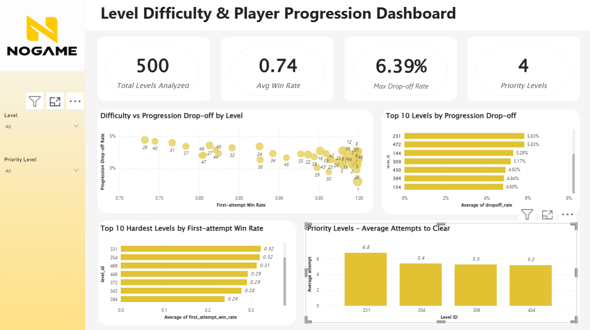

# NOGAME – Level Difficulty & Player Progression Analysis

## Overview

This project analyzes player behavior in a mobile puzzle game to identify levels that create excessive difficulty or progression friction.

The goal is not only to find the hardest levels, but to determine which levels should be prioritized for balancing based on a combination of:

- Level difficulty
- Player retry behavior
- Progression drop-off
- Player exposure

The analysis was performed using Python, DuckDB, Pandas, and Power BI.

---

## Business Problem

The game team needs to identify levels that may negatively affect the player journey and determine where balancing efforts should be prioritized.

The main business question is:

> **Which levels should the game team prioritize for balancing, and what actions should be considered for those levels?**

The analysis focuses on three questions:

1. Where are the main difficulty spikes?
2. Which difficult levels are associated with higher progression drop-off?
3. Which levels should be prioritized based on difficulty, player exposure, and progression impact?

---

## Data Scope

The analysis primarily uses gameplay events from:

- `level_start`
- `level_end`

The first **500 progression levels** are used as the main analysis scope.

Two important level fields are treated separately:

- `level_index`: player progression position
- `level_id`: level content identifier

This distinction is important because level content can be reused at later progression positions.

> Raw event-level data is not included in this repository. Only aggregated analysis outputs are provided.

---

## Data Quality & Assumptions

Several checks were performed before calculating level metrics.

### Status Validation

Player behavior after `level_end` events strongly supports:

- `status = 1` → successful level completion
- Other status values → treated conservatively as non-win outcomes

Specific meanings were not assigned to other status values because documentation was not available.

### Event Matching

A strict one-to-one match between `level_start` and `level_end` could not be assumed due to duplicated and unmatched event keys.

Therefore, final level difficulty metrics were calculated using aggregated gameplay events rather than arbitrary attempt-level deduplication.

### Progression Scope

The dataset contains progression positions beyond 500 and repeated level content at later progression positions.

For consistency, the main analysis focuses on progression positions **1–500**.

---

## Key Metrics

| Metric | Description |
|---|---|
| First-attempt Win Rate | Share of players who successfully complete a level on their first attempt |
| Attempt Win Rate | Share of all attempts ending in a successful completion |
| Average Attempts | Average number of attempts observed at a level |
| Average Playtime | Average playtime per level attempt |
| Revive Rate | Share of attempts where revive was used |
| Retry-after-fail Rate | Share of non-win attempts followed by another attempt at the same progression level |
| Progression Drop-off | Share of players reaching a progression level but not appearing at the next one |
| Users Reached | Number of players exposed to a progression level |

---

## Methodology

### 1. Level Difficulty Analysis

Difficulty is evaluated using multiple metrics rather than a single indicator.

The main signals include:

- Low first-attempt win rate
- High average attempts
- High revive usage
- High playtime

### 2. Retry Behavior

Player behavior after a non-win result is analyzed to understand whether difficult levels immediately discourage players.

This is measured using `retry_after_fail_rate`.

### 3. Progression Drop-off

For each progression position, the number of players reaching the current level is compared with the number appearing at the next level.

This helps identify locations where progression friction is more visible.

### 4. Priority Scoring

A heuristic priority score is used to support level shortlisting:

- **40% Difficulty**
- **40% Progression Drop-off**
- **20% Player Exposure**

The score is used as a prioritization aid rather than a predictive or causal model.

---

## Key Findings

### Difficulty is concentrated in specific levels

Several levels stand out with significantly lower first-attempt win rates and higher player effort compared with the broader level population.

### High difficulty does not always lead to immediate abandonment

Some difficult levels still show very high retry-after-fail rates.

This suggests that difficulty alone should not be interpreted as direct evidence of churn.

### Priority Levels

Four levels were selected for further investigation:

| Level | Main Concern |
|---|---|
| **231** | High average attempts and broad player exposure |
| **304** | Strong difficulty spike combined with progression friction |
| **309** | Very low first-attempt win rate and high revive usage |
| **434** | High difficulty, long playtime, and progression friction |

---

## Recommendations

### Level 231
Test a moderate difficulty reduction or additional player support because the level affects a relatively large number of players and requires repeated attempts.

### Level 304
Test a small increase in move limit or simplify part of the level layout.

### Level 309
Avoid a large nerf initially. Players continue retrying despite the difficulty, so improved hints, revive support, or a small balancing adjustment may be more appropriate.

### Level 434
Consider reducing level complexity or shortening the level experience due to the combination of difficulty, long playtime, and progression friction.

All balancing changes should ideally be validated through controlled experiments.

Suggested success metrics include:

- Level completion rate
- Attempts per completion
- Progression to the next level
- Downstream retention

---

## Dashboard

The Power BI dashboard allows interactive exploration of:

- Level difficulty
- First-attempt win rate
- Progression drop-off
- Player exposure
- Priority levels



---

## Repository Structure

```text
nogame-level-difficulty-analysis/
│
├── README.md
│
├── notebooks/
│   └── nogame_level_difficulty_analysis.ipynb
│
├── dashboard/
│   ├── nogame_level_dashboard.pbix
│   └── nogame_level_dashboard.png
│
├── report/
│   └── nogame_level_difficulty_report.pdf
│
└── data/
    ├── dashboard_levels.csv
    └── final_shortlist.csv
